```{=html}
<style>
.circle {
  background-color: #FFCCCB; /* Light red background */
  border: 2px solid teal; /* Teal border */
  border-radius: 50%; /* Makes the circle round */
  color: teal; /* Teal text color */
  width: 75px; /* Circle diameter */
  height: 75px; /* Circle diameter */
  display: inline-block;
  text-align: center;
  line-height: 75px; /* Match the height to center the text vertically */
  vertical-align: middle; /* Aligns the circle vertically with adjacent text */
  margin-right: 5px;
}
</style>
```
```{=html}
<style>
.highlight-box {
  background-color: yellow;
  padding: 10px;
  border-radius: 5px;
}
</style>
```
```{=html}
<style>
ul {
  font-size: 85%;
}

ul ul {
  font-size: 75%;
}
</style>
```

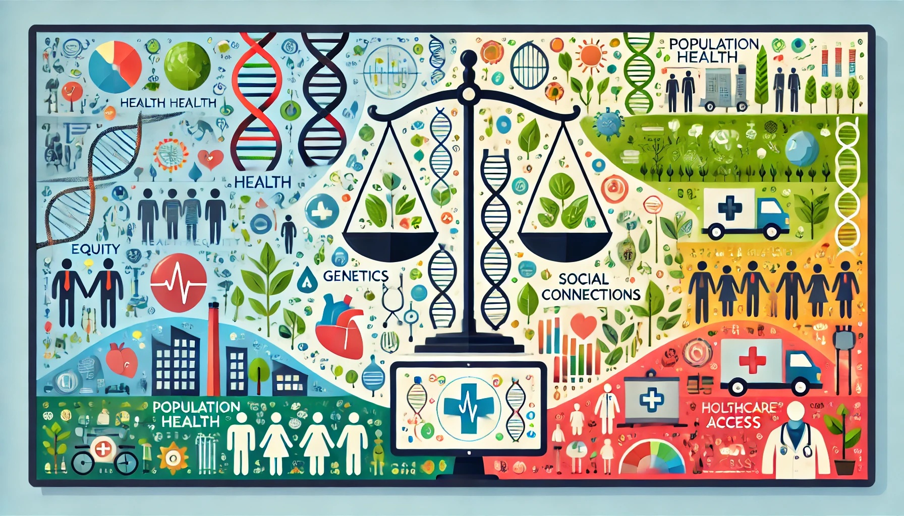{fig-align="center"}


# [**Chapter Overview**]{style="color: blue;"}

- Understanding why some people are healthier than others is a core focus of public health.
- Health is shaped by multiple factors, including:
  - Genetics
  - Lifestyle choices
  - Environment
  - Social conditions
- This presentation explores models explaining how determinants interact to influence population health.


------------------------------------------------------------------------

## [**What are determinants of health?**]{style="color: teal;"}

- **Determinants of health** are factors that influence an individual's or a population’s health.
- These determinants are often categorized into **five key groups**.
- Understanding these determinants helps in designing effective health policies and interventions.

------------------------------------------------------------------------

## [**Biological and Genetic Determinants**]{style="color: pink;"}

- **Genetics:** Inherited traits that influence susceptibility to diseases (e.g., family history of diabetes or heart disease).
- **Biological Factors:** Age, sex, and genetic conditions (e.g., Down syndrome, cystic fibrosis).
- **Example:** A person with a genetic predisposition to high cholesterol may develop heart disease if environmental and behavioral factors also contribute.

------------------------------------------------------------------------

## [**Behavioral Determinants**]{style="color: pink;"}

- Individual **lifestyle choices** that impact health.
- Key behaviors include:
  - **Diet and Nutrition:** Poor diet leads to obesity and related diseases.
  - **Physical Activity:** Lack of exercise increases risk for cardiovascular diseases.
  - **Substance Use:** Tobacco, alcohol, and drug use significantly affect health outcomes.
- **Example:** Smoking is a leading cause of lung cancer and heart disease.

------------------------------------------------------------------------

## [**Social and Economic Determinants**]{style="color: pink;"}

- **Education and Income:** Higher levels of education correlate with better health outcomes.
- **Employment and Working Conditions:** Stable employment provides income and health benefits.
- **Social Support Networks:** Strong community ties improve mental and physical health.
- **Example:** Individuals in low-income communities often have limited access to healthy foods and healthcare services.

------------------------------------------------------------------------

## [**Environmental Determinants**]{style="color: pink;"}

- **Physical Environment:** Pollution, climate change, and access to clean water affect health.
- **Built Environment:** Availability of sidewalks, parks, and grocery stores.
- **Housing Conditions:** Overcrowding and poor sanitation increase disease risks.
- **Example:** High air pollution in urban areas is linked to increased rates of asthma and respiratory diseases.

------------------------------------------------------------------------

## [**Healthcare Access and Quality**]{style="color: pink;"}

- **Availability of Healthcare Services:** Lack of access to preventive and emergency care worsens health disparities.
- **Health Insurance:** Affects affordability of medical care.
- **Cultural Competency:** Healthcare providers must address diverse patient needs.
- **Example:** Rural communities often experience healthcare shortages, leading to untreated conditions.


# [**Why Do We Need Health Determinant Models?**]{style="color: teal;"}

- Health is not just about treating diseases—it’s about **preventing** them.
- Important questions:
  - Why do wealthier neighborhoods have better health outcomes?
  - Why are chronic diseases more common in certain groups?
  - How do stress and social support affect mental health?
- Traditional **biomedical models** focus on treatment, but population health considers **broader social and environmental causes**.

------------------------------------------------------------------------

## [1]{.circle} [**The Epidemiologic Triad**]{style="color: teal;"}

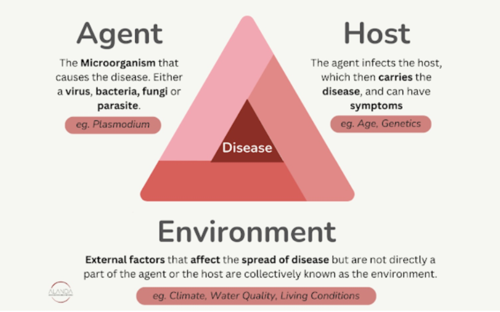{fig-align="center" width="527"}


------------------------------------------------------------------------

## [1]{.circle} [**The Epidemiologic Triad**]{style="color: teal;"}

- A **basic model for infectious diseases** with three components:
  1. **Host** – Individual or population affected.
  2. **Agent** – Disease-causing factor (e.g., bacteria, viruses, smoking).
  3. **Environment** – External factors affecting exposure (e.g., air pollution, sanitation).

- **Example: Tuberculosis**

  - **Agent:** Mycobacterium tuberculosis
  - **Host:** Weakened immunity due to malnutrition
  - **Environment:** Overcrowding increases risk
- **Limitation:** Does not fully explain chronic diseases.


------------------------------------------------------------------------

## [2]{.circle} [**The Health Field Model**]{style="color: teal;"}


- Shifted focus from infectious diseases to **chronic conditions**.
- Identifies **four major health determinants**:
  1. **Human Biology** – Genetic and physiological factors.
  2. **Lifestyle** – Behaviors like smoking, diet, exercise.
  3. **Environment** – Social and physical surroundings.
  4. **Healthcare System** – Access and quality of medical care.
  
------------------------------------------------------------------------

## [2]{.circle} [**The Health Field Model**]{style="color: teal;"}

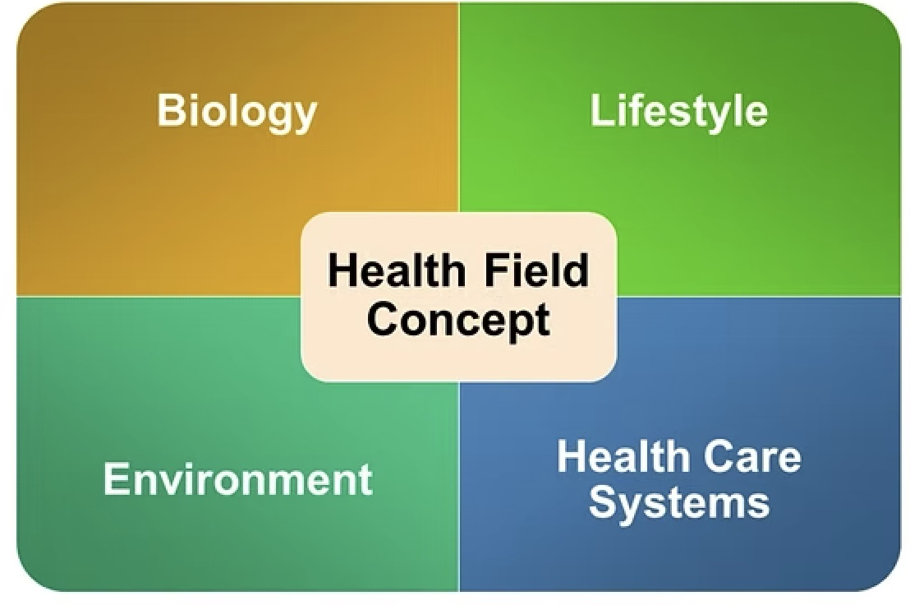{fig-align="center" width="327"}

**Example: Heart Disease**

- **Lifestyle:** Smoking, unhealthy diet.
- **Environment:** Food deserts, limited access to healthy food.
- **Healthcare System:** Focuses on treatment rather than prevention.
- **Biology**: Family history of heart disease, genetic predisposition to high cholesterol 

------------------------------------------------------------------------

## [2]{.circle} [**The Health Field Model**]{style="color: teal;"}

- A more **advanced** model

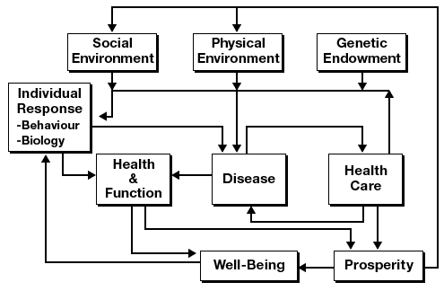{fig-align="center" width="227"}


------------------------------------------------------------------------

## [3]{.circle} [**The Socio-ecological model**]{style="color: teal;"}

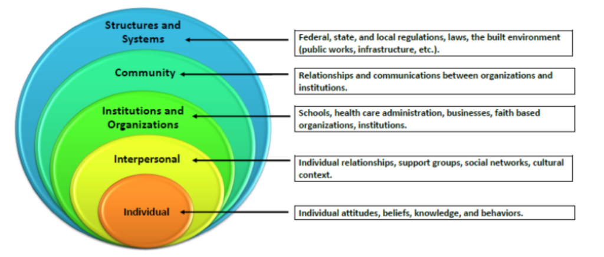{fig-align="center" width="327"}   


------------------------------------------------------------------------

## [3]{.circle} [**The Socio-ecological model**]{style="color: teal;"}

- **Health is shaped at multiple levels:**
  - **Individual** – Genetics, behavior.
  - **Interpersonal** – Family, social support.
  - **Community** – Schools, workplaces, healthcare access.
  - **Societal** – Laws, policies, economy.

**Example: Obesity Prevention**

- **Individual:** Encouraging healthy diet.
- **Community:** More grocery stores and parks.
- **Societal:** Taxes on unhealthy foods.


------------------------------------------------------------------------

## [4]{.circle} [**The Life Course Perspective**]{style="color: teal;"}

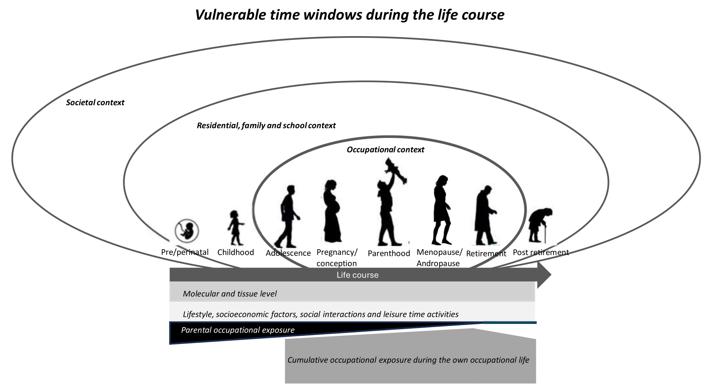{fig-align="center" width="327"}

------------------------------------------------------------------------

## [4]{.circle} [**The Life Course Perspective**]{style="color: teal;"}

- Health is **cumulative** and shaped over a lifetime
- Early-life exposures impact later health outcomes
- Critical periods: Childhood, adolescence, pregnancy
- Protective and risk factors evolve through different life stages

------------------------------------------------------------------------

## [4]{.circle} [**The Life Course Perspective**]{style="color: teal;"}

- Examines how **early-life experiences shape future health**.
- **Key Concepts:**
  1. **Latency Effects** – Early-life exposures impact adult health.
  2. **Cumulative Effects** – Stress builds up over time.
  3. **Pathway Effects** – Disadvantages in childhood limit future opportunities.

**Example: Childhood Poverty & Health**

- Poor nutrition in childhood → Increased risk for diabetes, heart disease in adulthood.
- Chronic stress affects **brain development**.

------------------------------------------------------------------------

## [4]{.circle} [**The Life Course Perspective**]{style="color: teal;"}


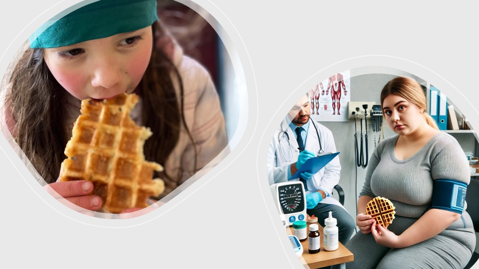{fig-align="center" width="327"}


------------------------------------------------------------------------

## [4]{.circle} [**The Life Course Perspective**]{style="color: teal;"}

- **Can geographic information keep you healthy?** [youtube-link](https://www.ted.com/talks/bill_davenhall_your_health_depends_on_where_you_live)
- *Bill Davenhall* from ESRI


------------------------------------------------------------------------

## [5]{.circle} [**Biopsychosocial Model**]{style="color: teal;"}

- Health is influenced by **biological, psychological, and social factors**
- **Biological:** Genetics, immune function, neurobiology
- **Psychological:** Stress, behavior, cognition
- **Social:** Environment, socioeconomic status, relationships
- **Interaction:** These domains interact dynamically, shaping health outcomes

------------------------------------------------------------------------

## [5]{.circle} [**Biopsychosocial Model**]{style="color: teal;"}

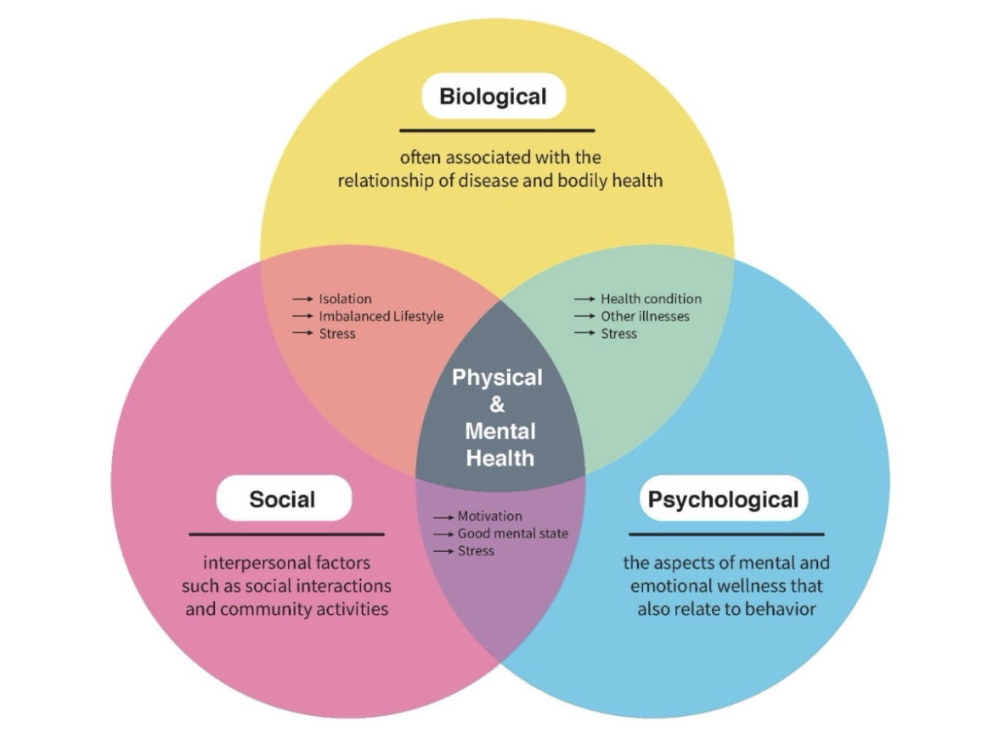{fig-align="center" width="327"}


## [**Pathways from Determinants to Health Outcomes**]{style="color: teal;"}


- **Upstream Determinants** (e.g., policy, environment) → 
- **Intermediate Factors** (e.g., behaviors, stress) → 
- **Downstream Outcomes** (e.g., disease, mortality)
- Example: **Socioeconomic Status → Diet & Stress → Cardiovascular Health**


# [**Pathway Analysis**]{style="color: teal;"}

- How do **various determinants interact** to influence health outcomes?
- **Mediators:** Factors that explain part of the relationship (e.g., stress mediates poverty → health)
- **Moderators:** Factors that modify the strength of the relationship (e.g., social support buffers stress effects)
- **Example:** Education → Health Literacy → Better Health Management


# [**Pathway Analysis**]{style="color: teal;"}
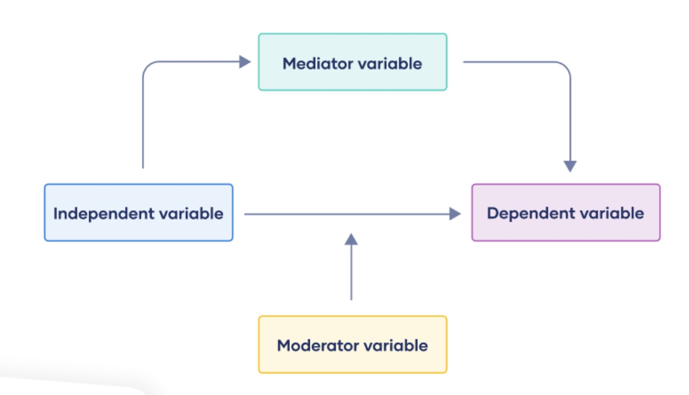{fig-align="center" width="327"}


# [**Pathway Analysis**]{style="color: teal;"}

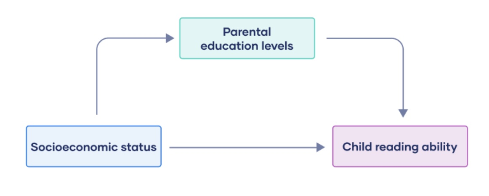{fig-align="center" width="327"}


# [**Pathway Analysis**]{style="color: teal;"}

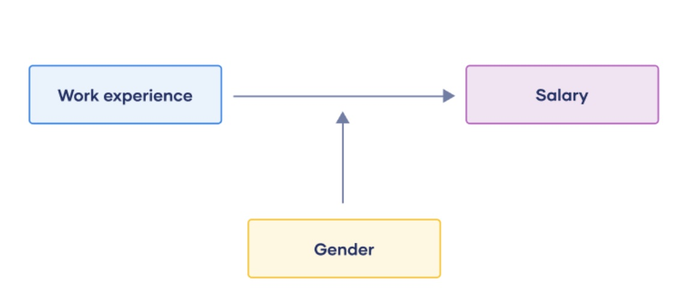{fig-align="center" width="327"}


## [**Nonlinear Dynamics & Health**]{style="color: teal;"}


- Health systems are **complex and nonlinear**
- **Feedback Loops:** 
  - Positive: Obesity → Inflammation → More Obesity
  - Negative: Stress → Social Support → Stress Reduction
- **Threshold Effects:** Small changes can lead to sudden shifts
  - Example: Chronic stress accumulation suddenly leading to burnout or illness


# [**Policy Implications & Future Directions**]{style="color: teal;"}

- **Health policies should be evidence-based and proactive**.
- **Types of interventions:**
  1. **Upstream:** Tackling root causes (e.g., poverty reduction).
  2. **Midstream:** Changing risk behaviors (e.g., smoking bans).
  3. **Downstream:** Treating diseases after they occur.


# [**Future trends**]{style="color: teal;"}
- **Precision Public Health** – Using **big data & genetics** for targeted interventions.
- **Climate Change & Health** – Understanding **environmental risks**.
- **Health Equity** – Ensuring **all populations** have access to resources.

# [**Conclusions**]{style="color: teal;"}

- **Health is shaped by multiple determinants**, not just healthcare.
- **Interventions must be multi-level** to be effective.
- **Understanding health models** helps in designing **better policies**.

**Reflection Questions:**

- 1. What social determinants impact your own health?
- 2. How can policies create healthier communities?


# [**Thank you!**]{style="color: teal;"}
